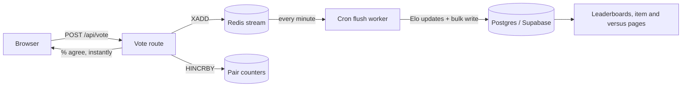

# Architecture

Tiebreak is built on a high-throughput, serverless architecture.

## Components
- **Next.js App Router**: Handles React Server Components and Edge API routes.
- **Upstash Redis**: Absorbs the high-velocity writes during viral voting events.
- **Supabase**: Handles Google Auth, persistent storage, and relational queries for the leaderboards. Row-Level Security (RLS) protects all user data (In Progress).
